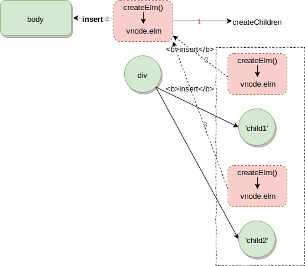

# patch
patch 和 Vue实例的挂载相关.

```js
// 带有el参数, 会自动触发挂载
new Vue({
  el: '#app',
  render (h) {
    return h('div', {}, 'text')
  }
})
// 需要手动调用$mount来触发挂载
(new Vue({
  render (h) {
    return h('div', {}, 'text')
  }
})).$mount()
```
挂载流程中, 需要先通过`render`得到组件的virtual DOM, 然后将其patch到DOM中.

**src/platforms/web/runtime/index.js**
```js
Vue.prototype.$mount = function (
  el?: string | Element,
  hydrating?: boolean
): Component {
  el = el && inBrowser ? query(el) : undefined
  return mountComponent(this, el, hydrating)
}
```
**src/core/instance/lifecycle.js**
```js{6,12}
export function mountComponent (
  vm: Component,
  el: ?Element,
  hydrating?: boolean
): Component {
    vm.$el = el
// ...

  let updateComponent
  // ...
    updateComponent = () => {
      vm._update(vm._render(), hydrating)
    }
    // ...
}
```
patch的过程在`vm._update`中

## vm._update()

```js
  Vue.prototype._update = function (vnode: VNode, hydrating?: boolean) {
    const vm: Component = this
    const prevEl = vm.$el
    const prevVnode = vm._vnode
    const restoreActiveInstance = setActiveInstance(vm)
    vm._vnode = vnode
    // Vue.prototype.__patch__ is injected in entry points
    // based on the rendering backend used.
    if (!prevVnode) {
      // initial render
      vm.$el = vm.__patch__(vm.$el, vnode, hydrating, false /* removeOnly */)
    } else {
      // updates
      vm.$el = vm.__patch__(prevVnode, vnode)
    }
    // ....
  }
```
关键代码如下
```js
    if (!prevVnode) {
      // initial render
      vm.$el = vm.__patch__(vm.$el, vnode, hydrating, false /* removeOnly */)
    } else {
      // updates
      vm.$el = vm.__patch__(prevVnode, vnode)
    }
```
分别对应首次渲染执行patch和状态更新执行patch

如果是首次patch, `vm.$el`取决于在实例化Vue的时候, 是否传递了`el`参数.
```js
// 带有el参数, 会自动触发挂载
new Vue({
  el: '#app',
  render (h) {
    return h('div', {}, 'text')
  }
})
// 需要手动调用$mount来触发挂载
(new Vue({
  render (h) {
    return h('div', {}, 'text')
  }
})).$mount()
```
对上述的代码中的栗子, 前者`vm.$el`是id为`#app`的DOM元素, 后者为`undefined`

`__patch__`过程因平台而异, 对于web平台来说, 最终是对应DOM操作, 其定义在

**src/platforms/web/runtime/index.js**
```js
import { patch } from './patch'
Vue.prototype.__patch__ = inBrowser ? patch : noop
```
**src/platforms/web/runtime/patch.js**
```js
/* @flow */

import * as nodeOps from 'web/runtime/node-ops'
import { createPatchFunction } from 'core/vdom/patch'
import baseModules from 'core/vdom/modules/index'
import platformModules from 'web/runtime/modules/index'

// the directive module should be applied last, after all
// built-in modules have been applied.
const modules = platformModules.concat(baseModules)

export const patch: Function = createPatchFunction({ nodeOps, modules })
```
可以看到为了代码复用, 和平台无关的patch逻辑代码在 **core/vdom/** 中, 而DOM相关操作代码则分离出来在 **web/runtime/** 下.

`nodeOps`中封装了DOM操作相关(create, insert, remove等)的函数. 

`modules`则分为`baseModules`和`platformModules`.

-  `platformModules`中封装了对DOM中style, class, events等相关的操作. 可以在patch的过程中调用
- `baseModules`则是封装了directives/ref相关的操作
:::tip
我们可以给custom directive提供相关钩子函数, 这些钩子函数就是在patch的过程中通过`baseModules`来调用的
:::

## patch

**core/vdom/patch.js**
```js
const hooks = ['create', 'activate', 'update', 'remove', 'destroy']

export function createPatchFunction (backend) {
  let i, j
  const cbs = {}

  const { modules, nodeOps } = backend

  for (i = 0; i < hooks.length; ++i) {
    cbs[hooks[i]] = []
    for (j = 0; j < modules.length; ++j) {
      if (isDef(modules[j][hooks[i]])) {
        cbs[hooks[i]].push(modules[j][hooks[i]])
      }
    }
  }

  function updateChildren (parentElm, oldCh, newCh, insertedVnodeQueue, removeOnly) {}

  return function patch (oldVnode, vnode, hydrating, removeOnly) {
  //...
  }
}
```
patch除了包括vNode更新时用到的相关对比算法以外, 还有另外一个很重要的功能, 就是在patch阶段各个阶段调用hooks, 而上文提到的`modules`就是被patch在各个阶段来调用的.

`createPatchFunction`利用闭包将modules中的钩子函数注册到`cbs`对象中, 并返回一个`patch`函数

```js
  return function patch (oldVnode, vnode, hydrating, removeOnly) {
    // 移除时
    if (isUndef(vnode)) {
      if (isDef(oldVnode)) invokeDestroyHook(oldVnode)
      return
    }

    let isInitialPatch = false
    const insertedVnodeQueue = []

    if (isUndef(oldVnode)) {
      // empty mount (likely as component), create new root element
      isInitialPatch = true
      createElm(vnode, insertedVnodeQueue)
    } else {
      const isRealElement = isDef(oldVnode.nodeType)
      if (!isRealElement && sameVnode(oldVnode, vnode)) {

      } else {
        if (isRealElement) {

        }
      }
    }

    invokeInsertHook(vnode, insertedVnodeQueue, isInitialPatch)
    return vnode.elm
  }
```

可以看到`patch`函数主要主要处理如下几种情况
- vnode移除时
- vnode创建时 (`oldVnode`传入`undefined`, 即调用`$mount`, 不传入`el`)
- vnode更新时 
  - 状态更新触发视图更新时, 且满足sameVnode
  - 传入了el参数, 此时`oldVnode`为真实的DOM元素
  - 状态更新触发视图更新时, 且不满足sameVnode, 且`oldVnode`不为真实的DOM元素

:::tip
`!isRealElement && sameVnode(oldVnode, vnode)`这个判断有点疑问, 我觉得当满足sameVnode的时候, 能够保证`!isRealElement`为`true`, 而[vue以前的代码](https://github.com/vuejs/vue/commit/3245ee6fe4588719483b909993e737682fa3cb3d)确实只有`sameVnode`这一个判断条件, 可能是为了某种我暂时没有想到的边界条件
:::

### vnode创建时

```js

    let isInitialPatch = false
    const insertedVnodeQueue = []

    if (isUndef(oldVnode)) {
      // empty mount (likely as component), create new root element
      isInitialPatch = true
      createElm(vnode, insertedVnodeQueue)
    } else {

    invokeInsertHook(vnode, insertedVnodeQueue, isInitialPatch)
    return vnode.elm
```
上述过程对应vnode创建时, 如下情况会走这分支

- 实例化Vue不指定`el`参数, 调用`$mount()`来挂载(empty mount)
- 创建子组件时(也是通过调用`$mount()`)

:::tip
```js
var MyComponent = Vue.extend({
  template: '<div>Hello!</div>'
})

// create and mount to #app (will replace #app)
new MyComponent().$mount('#app')

// the above is the same as:
new MyComponent({ el: '#app' })

// or, render off-document and append afterwards:
var component = new MyComponent().$mount()
document.getElementById('app').appendChild(component.$el)
```
:::

### vnode更新时
```js
 const isRealElement = isDef(oldVnode.nodeType)
      if (!isRealElement && sameVnode(oldVnode, vnode)) {

      } else {
        if (isRealElement) {

        }
      }
```
- 状态更新触发视图更新时, 且满足sameVnode
- 传入了el参数, 此时`oldVnode`为真实的DOM元素
- 状态更新触发视图更新时, 且不满足sameVnode, 且`oldVnode`不为真实的DOM元素

最后一种情况, 类似下面这种
```js
new Vue({
  el: "#app",
  data () {
    return {
      test: true
    }
  },
  render (h) {
    if (this.test) {
    return h('div',{class: 'test'}, 'test')
    } else {
      return h('a', {}, 'a')
    }
  }
})
```
当`test`变化触发视图更新时, oldVnode和 vnode不满足sameVnode

## case study 传入el参数的情况

```js
new Vue({
  el: "#app",
  render (h) {
    return h('div',{class: 'test'}, [
      'child1',
      'child2'
    ])
  }
})
```
```html
<div id="app"></div>
```

`new Vue`最终执行`Vue.prototype._init`中的挂载逻辑

**src/core/init.js**
```js

  Vue.prototype._init = function (options?: Object) {
    // ...
    if (vm.$options.el) {
      vm.$mount(vm.$options.el)
    }
  }
```

**src/platforms/web/runtime/index.js**
```js
Vue.prototype.$mount = function (
  el?: string | Element,
  hydrating?: boolean
): Component {
  el = el && inBrowser ? query(el) : undefined
  return mountComponent(this, el, hydrating)
}
```

由于我们指定了`el`参数, 所以最终调用
```js
vm.$el = vm.__patch__(vm.$el, vnode, hydrating, false /* removeOnly */)
```
`vm.$el`为页面中id为app的div元素, `vnode`为根组件的[virtual DOM](/2019-10-05-vuerender/#case-study-分析个栗子), `hydrating`为服务端渲染相关, 为`false`, `removeOnly`则用于组件`transition-group`

```js
  return function patch (oldVnode, vnode, hydrating, removeOnly) {
    if (isUndef(vnode)) {
      if (isDef(oldVnode)) invokeDestroyHook(oldVnode)
      return
    }

    let isInitialPatch = false
    const insertedVnodeQueue = []

    if (isUndef(oldVnode)) {
      //...
    } else {
      const isRealElement = isDef(oldVnode.nodeType)
      if (!isRealElement && sameVnode(oldVnode, vnode)) {
        // patch existing root node
        patchVnode(oldVnode, vnode, insertedVnodeQueue, null, null, removeOnly)
      } else {
        if (isRealElement) {
          // mounting to a real element
          // check if this is server-rendered content and if we can perform
          // a successful hydration.
          if (oldVnode.nodeType === 1 && oldVnode.hasAttribute(SSR_ATTR)) {
            oldVnode.removeAttribute(SSR_ATTR)
            hydrating = true
          }
          if (isTrue(hydrating)) {
            //...
          }
          // either not server-rendered, or hydration failed.
          // create an empty node and replace it
          oldVnode = emptyNodeAt(oldVnode)
        }

        // replacing existing element
        const oldElm = oldVnode.elm
        const parentElm = nodeOps.parentNode(oldElm)

        // create new node
        createElm(
          vnode,
          insertedVnodeQueue,
          // extremely rare edge case: do not insert if old element is in a
          // leaving transition. Only happens when combining transition +
          // keep-alive + HOCs. (#4590)
          oldElm._leaveCb ? null : parentElm,
          nodeOps.nextSibling(oldElm)
        )

        // update parent placeholder node element, recursively
        if (isDef(vnode.parent)) {
          //,,,
        }

        // destroy old node
        if (isDef(parentElm)) {
          removeVnodes(parentElm, [oldVnode], 0, 0)
        } else if (isDef(oldVnode.tag)) {
          invokeDestroyHook(oldVnode)
        }
      }

    invokeInsertHook(vnode, insertedVnodeQueue, isInitialPatch)
    return vnode.elm
  }
}
```

满足sameVnode的情况, 执行`patchVnode`也是相对复杂的一部分, 我们的case study暂时没有涉及到.
```js
  if (!isRealElement && sameVnode(oldVnode, vnode)) {
    // patch existing root node
    patchVnode(oldVnode, vnode, insertedVnodeQueue, null, null, removeOnly)
  } else {
```

对于`__patch__`返回的`patch`函数, 由于传入`el`, 不满足`!isRealElement && sameVnode(oldVnode, vnode)`

则根据`#app`的DOM元素创建一个vnode
```js
oldVnode = emptyNodeAt(oldVnode)

// emptyNodeAt
  function emptyNodeAt (elm) {
    return new VNode(nodeOps.tagName(elm).toLowerCase(), {}, [], undefined, elm)
  }
```
之后需要做的就是根据vnode创建DOM元素, 准备替换`#app`

```js
const oldElm = oldVnode.elm
const parentElm = nodeOps.parentNode(oldElm)
```

`oldVnode.elm`对应`#app`DOM元素, `parentElm`则是其父元素body

之后根据vnode创建DOM元素
```js
    createElm(
      vnode,
      insertedVnodeQueue,
      // extremely rare edge case: do not insert if old element is in a
      // leaving transition. Only happens when combining transition +
      // keep-alive + HOCs. (#4590)
      oldElm._leaveCb ? null : parentElm,
      nodeOps.nextSibling(oldElm)
    )
// createElm
  function createElm (
    vnode,
    insertedVnodeQueue,
    parentElm,
    refElm,
    nested,
    ownerArray,
    index
  ) {}

```

先跳过`createElm`的具体步骤, 可以预见, `createElm`就是通过vnode, 调用nodeOps中相关来创建DOM元素的, 并**插入到`parentElm`(body)中**

```js
if (isDef(vnode.parent)) {
  //...
}
```
`vnode.parent`指的是组件vnode的占位符vnode, 我们的case中没有子组件, 所以不涉及.


```js
  // destroy old node
  if (isDef(parentElm)) {
    removeVnodes(parentElm, [oldVnode], 0, 0)
  } else if (isDef(oldVnode.tag)) {
    invokeDestroyHook(oldVnode)
  }
```
之后就需要, 将body中的**原来的`#app`删除掉**

#### 疑问
暂时没有想到会调用`isDef(oldVnode.tag)`分支的场景, 可以研究这个[commit](https://github.com/vuejs/vue/commit/99a96d3c37d70c0fad842f45bcdf9147c10350aa#diff-c440e9dbcd3063ff09ef838fbf786a1eR144)

**更新**: 
[想到了执行上面代码的场景](#更新)

```js
    invokeInsertHook(vnode, insertedVnodeQueue, isInitialPatch)
```
patch函数最后还执行了`invokeInsertHook`, 就像`invokeDestroyHook`一样, 这些和生命钩子相关的函数全是与Vue组件化相关的.

### createElm
```js
  function createElm (
    vnode,
    insertedVnodeQueue,
    parentElm,
    refElm,
    nested,
    ownerArray,
    index
  ) {
    if (isDef(vnode.elm) && isDef(ownerArray)) {
      // This vnode was used in a previous render!
      // now it's used as a new node, overwriting its elm would cause
      // potential patch errors down the road when it's used as an insertion
      // reference node. Instead, we clone the node on-demand before creating
      // associated DOM element for it.
      vnode = ownerArray[index] = cloneVNode(vnode)
    }

    vnode.isRootInsert = !nested // for transition enter check
    if (createComponent(vnode, insertedVnodeQueue, parentElm, refElm)) {
      return
    }

    const data = vnode.data
    const children = vnode.children
    const tag = vnode.tag
    if (isDef(tag)) {
      if (process.env.NODE_ENV !== 'production') {
        //...
      }

      vnode.elm = vnode.ns
        ? nodeOps.createElementNS(vnode.ns, tag)
        : nodeOps.createElement(tag, vnode)
      setScope(vnode)

      /* istanbul ignore if */
      if (__WEEX__) {
        // ...
      } else {
        createChildren(vnode, children, insertedVnodeQueue)
        if (isDef(data)) {
          invokeCreateHooks(vnode, insertedVnodeQueue)
        }
        insert(parentElm, vnode.elm, refElm)
      }

      if (process.env.NODE_ENV !== 'production' && data && data.pre) {
        creatingElmInVPre--
      }
    } else if (isTrue(vnode.isComment)) {
      vnode.elm = nodeOps.createComment(vnode.text)
      insert(parentElm, vnode.elm, refElm)
    } else {
      vnode.elm = nodeOps.createTextNode(vnode.text)
      insert(parentElm, vnode.elm, refElm)
    }
  }
```
分析一下`createElm`的主要逻辑

`insertedVnodeQueue`默认传入的是空数组. 同样是组件化相关

在上面的栗子中, `parentElm`是body, `refElm`则是`#app`的next sibling

```js
    if (createComponent(vnode, insertedVnodeQueue, parentElm, refElm)) {
      return
    }
```
如果vnode对应着组件, 则`createComponent`则返回`true`, 直接`return`, 我们的case不涉及子组件, 所以可以忽略

```js
  vnode.elm = vnode.ns
    ? nodeOps.createElementNS(vnode.ns, tag)
    : nodeOps.createElement(tag, vnode)
  setScope(vnode)
```

DOM元素对应的vnode, 则创建对应DOM元素, 并设置style scope


```js
  render (h) {
    return h('div',{class: 'test'}, [
      'child1',
      'child2',
    ])
  }
```

这里所创建的DOM元素即为class为`test`的div元素

```js
  function createChildren (vnode, children, insertedVnodeQueue) {
    if (Array.isArray(children)) {
      if (process.env.NODE_ENV !== 'production') {
        checkDuplicateKeys(children)
      }
      for (let i = 0; i < children.length; ++i) {
        createElm(children[i], insertedVnodeQueue, vnode.elm, null, true, children, i)
      }
    } else if (isPrimitive(vnode.text)) {
      nodeOps.appendChild(vnode.elm, nodeOps.createTextNode(String(vnode.text)))
    }
  }
```
接着创建div的子元素, 遍历`children`调用`createElm`, 并传入`parentElm`(`vnode.elm` class为`test`的div元素), 可见这是一个深度优先遍历的过程. 除此之外, `refElm`传`null` (因为不需要参考的元素, 直接appendChild往父元素中添加子元素就可以), 传入了`ownerArray`, `index`(作用暂且不讨论 TODO:)

### chart



## 更新
之前一处[疑问](#疑问)

```js
var a = new Vue({
  data () {
    return {
      test: true
    }
  },
  render (h) {
    if (this.test) {
    return h('div',{class: 'test'}, 'test')
    } else {
      return h('a', {}, 'a')
    }
  }
})
a.$mount()
setTimeout(() => {
  a.test = false
}, 10000)
```

在上面的场景中, 当timeout中的逻辑执行时, 会销毁old vnode, 
```js
  // destroy old node
  if (isDef(parentElm)) {
    removeVnodes(parentElm, [oldVnode], 0, 0)
  } else if (isDef(oldVnode.tag)) {
    invokeDestroyHook(oldVnode)
  }
```
由于我们的Vue实例并没有关联到DOM中, 这样我们不需要从DOM中删除该vnode 对应的元素, 并执行一些destroy相关的hook. 我们仅仅需要执行destroy相关的hook, 比如, 如果我们使用了ref属性, 那么destroy的时候, 我们需要将其在`vm.$refs`中剔除, 置为`undefined`
