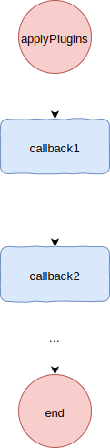
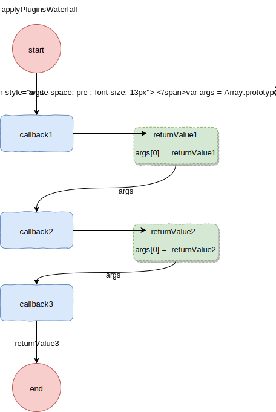
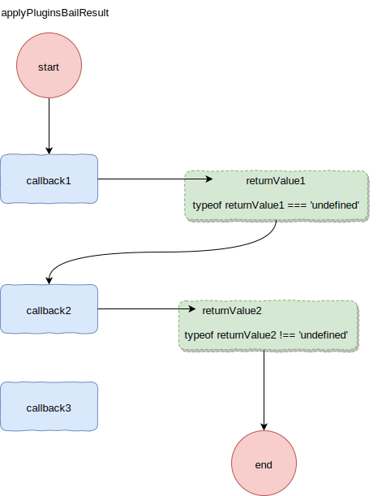
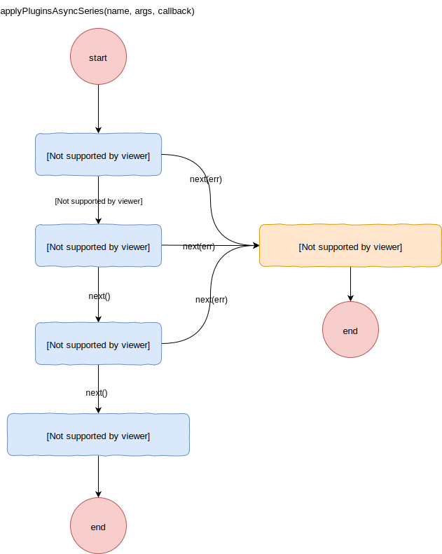
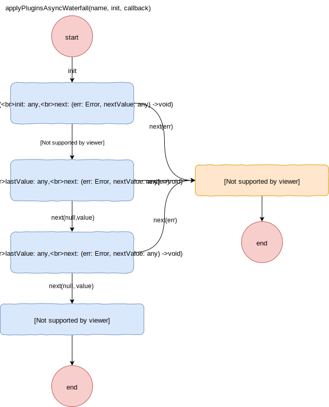

# tapable 0.2.8

在webpack 1-3中, 依赖着tapable0.x版本, 使用它来添加和应用插件. tapable 2.x对项目进行了重构, 代码非常值得去分析, 追本溯源, 了解其0.x版本的代码, 并对比重构前后的代码, 希望有所收获.

webpack在其编译过程中,提供了很多hooks, 插件可以在这些hooks上注册回调函数, 这些hooks也可以认为是事件.
## webpack 插件
一个插件应该是类似如下这样的
```js
// MyPlugin.js

function MyPlugin(options) {
  // Configure your plugin with options...
}

MyPlugin.prototype.apply = function(compiler) {
  compiler.plugin("compile", function(params) {
    console.log("The compiler is starting to compile...");
  });
};

module.exports = MyPlugin;
```

## tapable实例
compiler是一个tapable子类(Compiler)的实例

插件提供apply方法, 通过`compiler.plugin()`在compile hook上注册回调函数

Compiler的实现应该是类似这样的, 当然也可以使用es6语法
```js
var Tapable = require("tapable");

function Compiler() {
    Tapable.call(this);
}

Compiler.prototype = Object.create(Tapable.prototype);

```
Compiler实例可以调用注册的hooks回调方法
```js
var compiler = new Compiler()
compiler.applyPlugins('compile', params)
```

webpack通过调用插件定义的apply方法, 来注册hooks回调函数, 并在合适的时机来执行这些回调函数. 因此tapable是和nodejs的EventEmitter是比较类似的. tapable0.x和EventEmitter同样都是使用**观察者模式**来实现的.

:::tip
tapable0.x在注册hooks回调的时候非常不直观, 因为都是通过`tapableInstance.plugin()`, 所以注册的是异步回调还是同步回调, 需要依据具体回调函数的实现
:::

## tapable分析
### apply
`void apply(plugins: Plugin...)`

tapable实例提供了apply方法, 从而来调用插件提供的apply方法. 

[webpack3中是这样调用的](https://github.com/webpack/webpack/blob/cce33c206abaeef26d06b62102adf74a989a4696/lib/webpack.js#L32-L34)

```js
  if(options.plugins && Array.isArray(options.plugins)) {
    compiler.apply.apply(compiler, options.plugins);
  }
```
其实现也很简单
```js
Tapable.prototype.apply = function apply() {
	for(var i = 0; i < arguments.length; i++) {
		arguments[i].apply(this);
	}
};
```
遍历插件, 调用其apply方法, 并传入tapable实例作为参数.
:::tip
tapable1.x以后, apply就被废弃了, webpack会直接调用插件的apply方法. 这样tapable就可以更加专注于hooks的注册和调用.
:::

### plugin
`void plugin(names: string|string[], handler: Function)`

通过plugin方法, 可以注册一个或多个hooks回调函数

```js
function Tapable() {
	this._plugins = {};
}

Tapable.prototype.plugin = function plugin(name, fn) {
	if(Array.isArray(name)) {
		name.forEach(function(name) {
			this.plugin(name, fn);
		}, this);
		return;
	}
	if(!this._plugins[name]) this._plugins[name] = [fn];
	else this._plugins[name].push(fn);
};
```
如果`name`是数组, 则递归调用`plugin`方法, 内部维护`_plugins`对象, 来管理所注册的hooks回调.

### applyPlugins
`void applyPlugins(name: string, args: any...)
`



针对注册的回调函数为同步函数

```js
Tapable.prototype.applyPlugins = function applyPlugins(name) {
	if(!this._plugins[name]) return;
	var args = Array.prototype.slice.call(arguments, 1);
	var plugins = this._plugins[name];
	for(var i = 0; i < plugins.length; i++)
		plugins[i].apply(this, args);
};
```
根据传入的`name`找到`_plugins`下的所有回调函数, 遍历执行.


### applyPluginsWaterfall
`any applyPluginsWaterfall(name: string, init: any, args: any...)
`



针对回调函数为同步函数, 使用`Waterfall`的方式

```js
Tapable.prototype.applyPluginsWaterfall = function applyPluginsWaterfall(name, init) {
	if(!this._plugins[name]) return init;
	var args = Array.prototype.slice.call(arguments, 1);
	var plugins = this._plugins[name];
	var current = init;
	for(var i = 0; i < plugins.length; i++) {
		args[0] = current;
		current = plugins[i].apply(this, args);
	}
	return current;
};
```
waterfall的方式会将上一个callback return的值,传给下一个callback. 

`applyPluginsWaterfall`的`init`参数为传给第一个callback的值, 然后不断将`args[0]`替换成callback return的值, 从而进行传递

### applyPluginsBailResult
`any applyPluginsBailResult(name: string, args: any...)
`


针对回调函数为同步函数, 使用`Bail`的方式

```js
Tapable.prototype.applyPluginsBailResult = function applyPluginsBailResult(name) {
	if(!this._plugins[name]) return;
	var args = Array.prototype.slice.call(arguments, 1);
	var plugins = this._plugins[name];
	for(var i = 0; i < plugins.length; i++) {
		var result = plugins[i].apply(this, args);
		if(typeof result !== "undefined") {
			return result;
		}
	}
};
```
bail的方式, 会顺序调用callbacks, 如果遇到某个callback return 非`undefined`的值, 则跳出循环, 不再执行接下去的callbacks. 其代码和`applyPlugins`非常类似.

### applyPluginsAsync/applyPluginsAsyncSeries
```js
applyPluginsAsyncSeries(
	name: string,
	args: any...,
	callback: (err: Error) -> void
)

```



注册的回调函数是异步的, 可以使用这个方法来保证各个回调函数是顺序执行的
```js
Tapable.prototype.applyPluginsAsyncSeries = Tapable.prototype.applyPluginsAsync = function applyPluginsAsyncSeries(name) {
  var args = Array.prototype.slice.call(arguments, 1);
  // 最后一个参数是callback
	var callback = args.pop();
  var plugins = this._plugins[name];
  // 若没有注册回调函数, 直接执行callback
	if(!plugins || plugins.length === 0) return callback();
	var i = 0;
  var _this = this;
  // 将callback包装为next函数
	args.push(copyProperties(callback, function next(err) {
    // 如果有错误
		if(err) return callback(err);
    i++;
    // 所有注册的回调执行完毕, 执行callback
		if(i >= plugins.length) {
			return callback();
    }
    // 执行回调函数
		plugins[i].apply(_this, args);
	}));
	plugins[0].apply(this, args);
};

function copyProperties(from, to) {
	for(var key in from)
		to[key] = from[key];
	return to;
}
```
注册的hook回调函数是异步的, 这个回调函数接收的最后一个参数是`next(err: Error)`函数

通过调用next函数来执行下一个注册的回调函数, 在所有注册的回调函数都执行完后, 会执行`callback(err: Error)`(applyPluginsAsyncSeries的最后一个参数)

又或者注册的回调函数给next传递了error, 则会终止后续逻辑, 并执行`callback(err)`

### applyPluginsAsyncWaterfall
```js
applyPluginsAsyncWaterfall(
	name: string,
	init: any,
	callback: (err: Error, result: any) -> void
)

```


注册的回调函数是异步的, 使用`Waterfall`的方式

```js
Tapable.prototype.applyPluginsAsyncWaterfall = function applyPluginsAsyncWaterfall(name, init, callback) {
	if(!this._plugins[name] || this._plugins[name].length === 0) return callback(null, init);
	var plugins = this._plugins[name];
	var i = 0;
	var _this = this;
	var next = copyProperties(callback, function(err, value) {
		if(err) return callback(err);
		i++;
		if(i >= plugins.length) {
			return callback(null, value);
		}
		plugins[i].call(_this, value, next);
	});
	plugins[0].call(this, init, next);
};
```
可以发现其和`applyPluginsAsyncSeries`的代码非常类似, 都是通过next函数来和下一个回调函数建立连接, 但是`applyPluginsAsyncWaterfall`还可以通过next(null, value)来传递value给下一个回调函数. 

:::tip
`applyPluginsWaterfall(name: String, init: any, args: any...)`除了传递init参数, 还可以继续传递参数

`applyPluginsAsyncWaterfall`则只能传递一个init参数和一个callback参数
:::


### applyPluginsAsyncSeriesBailResult
注册的回调函数是异步的, 使用`Bail`的方式
```js{9}
Tapable.prototype.applyPluginsAsyncSeriesBailResult = function applyPluginsAsyncSeriesBailResult(name) {
	var args = Array.prototype.slice.call(arguments, 1);
	var callback = args.pop();
	if(!this._plugins[name] || this._plugins[name].length === 0) return callback();
	var plugins = this._plugins[name];
	var i = 0;
	var _this = this;
	args.push(copyProperties(callback, function next() {
		if(arguments.length > 0) return callback.apply(null, arguments);
		i++;
		if(i >= plugins.length) {
			return callback();
		}
		plugins[i].apply(_this, args);
	}));
	plugins[0].apply(this, args);
};

```

其实现和`applyPluginsAsyncSeries`类似

### applyPluginsParallel
```js
applyPluginsParallel(
	name: string,
	args: any...,
	callback: (err?: Error) -> void
)
```

执行各个回调函数, 回调函数可能是异步的, 和`Promise.all`类似

```js
Tapable.prototype.applyPluginsParallel = function applyPluginsParallel(name) {
	var args = Array.prototype.slice.call(arguments, 1);
	var callback = args.pop();
	if(!this._plugins[name] || this._plugins[name].length === 0) return callback();
	var plugins = this._plugins[name];
	var remaining = plugins.length;
	args.push(copyProperties(callback, function(err) {
		if(remaining < 0) return; // ignore
		if(err) {
			remaining = -1;
			return callback(err);
		}
		remaining--;
		if(remaining === 0) {
			return callback();
		}
	}));
	for(var i = 0; i < plugins.length; i++) {
		plugins[i].apply(this, args);
		if(remaining < 0) return;
	}
};
```
执行各个注册的回调函数, 并记录还未执行完的数量, 当全部都执行完后, 就执行callback. 


### applyPluginsParallelBailResult
```js
applyPluginsParallelBailResult(
	name: string,
	args: any...,
	callback: (err: Error, result: any) -> void
)
```

```js
Tapable.prototype.applyPluginsParallelBailResult = function applyPluginsParallelBailResult(name) {
	var args = Array.prototype.slice.call(arguments, 1);
	var callback = args[args.length - 1];
	if(!this._plugins[name] || this._plugins[name].length === 0) return callback();
	var plugins = this._plugins[name];
	var currentPos = plugins.length;
	var currentResult;
	var done = [];
	for(var i = 0; i < plugins.length; i++) {
		args[args.length - 1] = (function(i) {
			return copyProperties(callback, function() {
				if(i >= currentPos) return; // ignore
				done.push(i);
				if(arguments.length > 0) {
					currentPos = i + 1;
					done = fastFilter.call(done, function(item) {
						return item <= i;
					});
					currentResult = Array.prototype.slice.call(arguments);
				}
				if(done.length === currentPos) {
					callback.apply(null, currentResult);
					currentPos = 0;
				}
			});
		}(i));
		plugins[i].apply(this, args);
	}
};
```

如果注册回调如下,

```js
tapableInstance.plugin('a', (cb) => {
  setTimeout(() => {
    cb(null, 'params1')
  }, 300)
})
tapableInstance.plugin('a', (cb) => {
  cb(null, 'params2')
})

tapableInstance.applyPluginsParallelBailResult('a', function(err, arg) {
  console.log(arg) // params1
})
```
执行各个注册的回调函数, 如果某个函数调用了cb, 且传递了值(无论传了err, 或 result), 那么判断调在其前面注册的回调函数是否都执行过next(没有传值), 如果都执行过, 则调用`callback(null, 'params')`
:::tip
`applyPluginsParallelBailResult`, 执行callback的条件和`applyPluginsBailResult`其实是类似的

 `applyPluginsBailResult`执行callback的条件是, 前面注册的回调函数都return undefined, 直到执行到某个回调函数return 非undefined.

`applyPluginsParallelBailResult`执行callback的条件是,某个注册的回调函数调用了cb,且传值了, 且在其之前注册的回调函数全都调用了cb, 且未传值.

:::

:::tip
applyPluginsAsync***的方法, 虽说是针对注册的回调函数为异步的情况, 但是如果注册的回调函数是同步的, 也是适用的.
:::
## 性能
在tapable0.x中的代码中还有`applyPlugins0`,`applyPlugins1`等方法, 内部使用函数的`call`来代替`apply`来执行回调, 从而提升性能, [jsperf测试代码](https://jsperf.com/tapable)

## 应用场景
TODO:

## 痛点
tapable0.x代码重复度还是比较高的