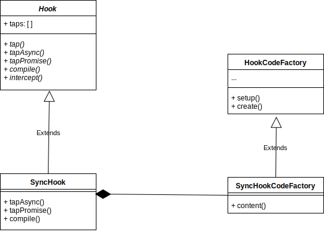

# tapable 2.0.0-beta.8

在tapable0.x中, 需要继承tapable才能使用它的钩子. tapable2.x更加专注于钩子本身, 使用它更加直接.

```js
const { SyncHook } = require('tapable')

class Car {
  constructor() {
    this.hooks = {
      accelerate: new SyncHook(['newSpeed'])
    }
  }
  setSpeed(newSpeed) {
    this.hooks.accelerate.call(newSpeed)
  }
}

const myCar = new Car()
myCar.hooks.accelerate.tap('LoggerPlugin', newSpeed =>
  console.log(`Accelerating to ${newSpeed}`)
)
myCar.setSpeed(666) // Accelerating to 666

```
## SyncHook UML



```js

const factory = new SyncHookCodeFactory();

const TAP_ASYNC = () => {
	throw new Error("tapAsync is not supported on a SyncHook");
};

const TAP_PROMISE = () => {
	throw new Error("tapPromise is not supported on a SyncHook");
};

const COMPILE = function(options) {
	factory.setup(this, options);
	return factory.create(options);
};

function SyncHook(args = [], name = undefined) {
	const hook = new Hook(args, name);
	hook.constructor = SyncHook;
	hook.tapAsync = TAP_ASYNC;
	hook.tapPromise = TAP_PROMISE;
	hook.compile = COMPILE;
	return hook;
}
```

以SyncHook为例, Hook相当于一个抽象类, SyncHook在其基础上, 提供自己的compile, tapAsync, tapPromise.

在SyncHook实例上注册的回调函数是同步调用的, 通过tap来注册, 由其基类Hook来提供方法, 调用tapAsync, tapPromise则抛出错误.

:::tip
在SyncHook实例上注册的回调函数, 为了便于说明, 称其为注册事件
:::