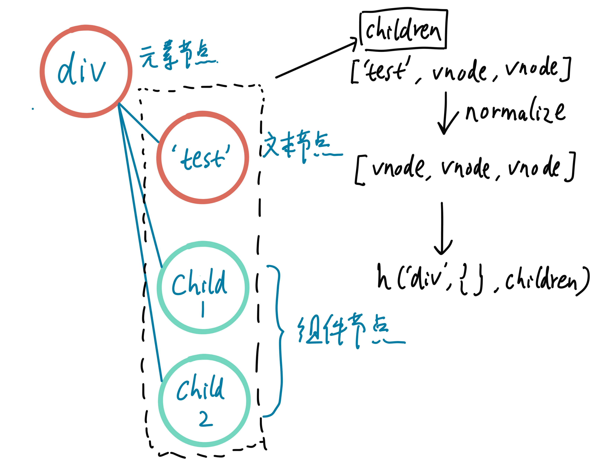

# render流程

根组件在实例化后, 调用$mount来挂载组件, 从而开始组件的render, patch

## _render()

Vue内部使用vm._render()来生成vnode, 下面是是部分关键代码

关于virtual dom, 尤雨溪在知乎的一个回答很值得一看
> [网上都说操作真实 DOM 慢，但测试结果却比 React 更快，为什么？ - 尤雨溪的回答 - 知乎](https://www.zhihu.com/question/31809713/answer/53544875)

**src/core/instance/render.js**
```js
export function initRender (vm: Component) {
  vm._c = (a, b, c, d) => createElement(vm, a, b, c, d, false)
  // user-written render functions.
  vm.$createElement = (a, b, c, d) => createElement(vm, a, b, c, d, true)
}
export function renderMixin (Vue: Class<Component>) {
  // install runtime convenience helpers
  installRenderHelpers(Vue.prototype)
  //....
  Vue.prototype._render = function (): VNode {
    const vm: Component = this
    const { render, _parentVnode } = vm.$options

    if (_parentVnode) {
      vm.$scopedSlots = normalizeScopedSlots(
        _parentVnode.data.scopedSlots,
        vm.$slots,
        vm.$scopedSlots
      )
    }

    // set parent vnode. this allows render functions to have access
    // to the data on the placeholder node.
    vm.$vnode = _parentVnode
    // render self
    let vnode
    try {
      currentRenderingInstance = vm
      vnode = render.call(vm._renderProxy, vm.$createElement)
    } catch (e) {
    // ...
        vnode = vm._vnode
    } finally {
      currentRenderingInstance = null
    }
    // if the returned array contains only a single node, allow it
    if (Array.isArray(vnode) && vnode.length === 1) {
      vnode = vnode[0]
    }
    // return empty vnode in case the render function errored out
    if (!(vnode instanceof VNode)) {
      vnode = createEmptyVNode()
    }
    // set parent
    vnode.parent = _parentVnode
    return vnode
  }
}
```

可以看到`_render`的主要逻辑是调用`vnode = render.call(vm._renderProxy, vm.$createElement)`
:::tip
`vm.$createElement`也就是常说的h函数
:::

`render`有两个来源
- 用户写的render函数
- .vue文件中template编译而来, 它内部会使用`vm._c`而非`render(h)`函数的`h`参数(即`vm.$createElement`)

:::tip
编译出来的render函数类似这种, `with(this){return [_c('div',[[_c('span',[_v("1")]),_v(" "),_c('span',[_v("2")])]],2)]}`
:::

## createElement()
render函数通过调用h函数来生成vnode, h函数是调用了createElement

```js
  vm.$createElement = (a, b, c, d) => createElement(vm, a, b, c, d, true)
```

**src/core/vdom/create-element.js**
```js
export function createElement (
  context: Component,
  tag: any,
  data: any,
  children: any,
  normalizationType: any,
  alwaysNormalize: boolean
): VNode | Array<VNode> {
 // 允许不传入data, 直接传入children(函数重载)
  if (Array.isArray(data) || isPrimitive(data)) {
    normalizationType = children
    children = data
    data = undefined
  }
  if (isTrue(alwaysNormalize)) {
    normalizationType = ALWAYS_NORMALIZE
  }
  return _createElement(context, tag, data, children, normalizationType)
}
```

对于用户定义的`render`函数, 需要进行`normailize`, 并且设置`normalizationType`, 因此在内部调用的`_createElement`的参数`tag,data,children`是由开发者传入的, 而`normalizationType`开发者传入也是会被覆盖的, 其是在`alwaysNormalize`为`false`使用的(作为编译出的render函数的参数)

## _createElement()
```js
export function _createElement (
  context: Component,
  tag?: string | Class<Component> | Function | Object,
  data?: VNodeData,
  children?: any,
  normalizationType?: number
): VNode | Array<VNode> {
  // object syntax in v-bind
  // is属性
  if (isDef(data) && isDef(data.is)) {
    tag = data.is
  }
  if (!tag) {
    // in case of component :is set to falsy value
    return createEmptyVNode()
  }
  // support single function children as default scoped slot
  if (Array.isArray(children) &&
    typeof children[0] === 'function'
  ) {
    data = data || {}
    data.scopedSlots = { default: children[0] }
    children.length = 0
  }
  if (normalizationType === ALWAYS_NORMALIZE) {
    children = normalizeChildren(children)
  } else if (normalizationType === SIMPLE_NORMALIZE) {
    children = simpleNormalizeChildren(children)
  }
  let vnode, ns
  // DOM tag/ 局部注册的组件
  if (typeof tag === 'string') {
  //...
  } else {
  // 传入组件的配置对象或者组件的构造函数
    // direct component options / constructor
    vnode = createComponent(tag, data, context, children)
  }
  if (Array.isArray(vnode)) {
    return vnode
  } else if (isDef(vnode)) {
    if (isDef(ns)) applyNS(vnode, ns)
    if (isDef(data)) registerDeepBindings(data)
    return vnode
  } else {
    return createEmptyVNode()
  }
}
```

`_createElement`首先对children进行格式化. 需要格式化成`Array<VNode>`,

比如, 手写的render函数, 对于text VNodes, 传入的是string, 需要要根据string创建text VNodes.

```js
new Vue({
  el: "#app",
  data () {
  	return {}
  },
  render (h) {
    return h('div',{}, [
      'test'
    ])
  }
})
```

又比如
```html
<template>
  <div id="app">
    <span v-for="i in 2" :key=`span1_${i}`>1</span>
    <span v-for="i in 2" :key=`span2_${i}`>2</span>
  </div>
 </template>
```

在创建div对应的vnode的时候, 其children为`[[vnodespan1_1, vnodespan1_2], [vnodespan2_1, vnodespan2_2]`(v-for指令生成), 所以需要将其flatten成长度为4的数组

:::tip
`v-for`内部由函数`renderList`(**src/core/instance/render-helpers/render-list.js**)实现, 其返回一个数组
:::

还有其他情况需要格式化, 这里先不讨论.

格式化之后, 代码主要对`tag`为string和非string的情况做对应的处理.

**string**
- 创建DOM元素对应的vnode
- 内部注册的组件

**非string**
- component option即Vue组件的配置对象
- 组件构造函数(比如来自Vue.extend)

因此vnode除了对应DOM之外, 也可以对应Vue组件, 前者直接来源于`new VNode`, 后者来源`createComponent`(最后也会调用`new VNode`)

```js
  if (typeof tag === 'string') {
    let Ctor
    ns = (context.$vnode && context.$vnode.ns) || config.getTagNamespace(tag)
    if (config.isReservedTag(tag)) {
      // platform built-in elements
      vnode = new VNode(
        config.parsePlatformTagName(tag), data, children,
        undefined, undefined, context
      )
    } else if ((!data || !data.pre) && isDef(Ctor = resolveAsset(context.$options, 'components', tag))) {
      // component
      vnode = createComponent(Ctor, data, context, children, tag)
    } else {
      // unknown or unlisted namespaced elements
      // check at runtime because it may get assigned a namespace when its
      // parent normalizes children
      vnode = new VNode(
        tag, data, children,
        undefined, undefined, context
      )
    }
  } else {
    // direct component options / constructor
    vnode = createComponent(tag, data, context, children)
  }
```

对于string, 先用`config.isReservedTag`判断是否是reserverdTag, 在浏览器端就是判断是否是原生DOM元素对应的tag. 显然这个函数是与平台相关的.

在初始化Vue全局api的时候, 将`Vue.config`和上面的`config`绑定在一起

**src/core/global-api/index.js**
```js
export function initGlobalAPI (Vue: GlobalAPI) {
  // config
  const configDef = {}
  configDef.get = () => config
  if (process.env.NODE_ENV !== 'production') {
    configDef.set = () => {
      warn(
        'Do not replace the Vue.config object, set individual fields instead.'
      )
    }
  }
  Object.defineProperty(Vue, 'config', configDef)
  //...

}
```

然后在Vue web平台代码的入口文件中(此时`initGlobalAPI`已经执行), 设置成具体平台所对应的函数(平台相关的函数代码在**src/platforms/web/util/index.js**)

**src/platforms/web/runtime/index.js**
```js
// install platform specific utils
Vue.config.mustUseProp = mustUseProp
Vue.config.isReservedTag = isReservedTag
Vue.config.isReservedAttr = isReservedAttr
Vue.config.getTagNamespace = getTagNamespace
Vue.config.isUnknownElement = isUnknownElement
```

若是DOM tag, 则创建对应vnode
```js
      vnode = new VNode(
        config.parsePlatformTagName(tag), data, children,
        undefined, undefined, context
      )
```
:::tip
对于web平台`config.parsePlatformTagName(tag)`返回`tag`

**VNode constructor**
```js
  constructor (
    tag?: string,
    data?: VNodeData,
    children?: ?Array<VNode>,
    text?: string,
    elm?: Node,
    context?: Component,
    componentOptions?: VNodeComponentOptions,
    asyncFactory?: Function
  )
```
:::

### createComponent
创建组件对应的vnode

**src/core/vdom/create-component.js**
```js
export function createComponent (
  Ctor: Class<Component> | Function | Object | void,
  data: ?VNodeData,
  context: Component,
  children: ?Array<VNode>,
  tag?: string
): VNode | Array<VNode> | void {
  if (isUndef(Ctor)) {
    return
  }

  const baseCtor = context.$options._base

  // plain options object: turn it into a constructor
  if (isObject(Ctor)) {
    Ctor = baseCtor.extend(Ctor)
  }

  // if at this stage it's not a constructor or an async component factory,
  // reject.
  if (typeof Ctor !== 'function') {
  //..
  }

  // async component
  let asyncFactory
  if (isUndef(Ctor.cid)) {
  //...
  }

  data = data || {}

  // resolve constructor options in case global mixins are applied after
  // component constructor creation
  // https://github.com/vuejs/vue/issues/3957
  resolveConstructorOptions(Ctor)

  // transform component v-model data into props & events
  if (isDef(data.model)) {
    transformModel(Ctor.options, data)
  }

  // extract props
  // 对props 和attrs做区分
  const propsData = extractPropsFromVNodeData(data, Ctor, tag)

  // functional component
  if (isTrue(Ctor.options.functional)) {
    return createFunctionalComponent(Ctor, propsData, data, context, children)
  }

  // extract listeners, since these needs to be treated as
  // child component listeners instead of DOM listeners
  const listeners = data.on
  // replace with listeners with .native modifier
  // so it gets processed during parent component patch.
  data.on = data.nativeOn

  if (isTrue(Ctor.options.abstract)) {
    // abstract components do not keep anything
    // other than props & listeners & slot

    // work around flow
    const slot = data.slot
    data = {}
    if (slot) {
      data.slot = slot
    }
  }

  // install component management hooks onto the placeholder node
  installComponentHooks(data)

  // return a placeholder vnode
  const name = Ctor.options.name || tag
  const vnode = new VNode(
    `vue-component-${Ctor.cid}${name ? `-${name}` : ''}`,
    data, undefined, undefined, undefined, context,
    { Ctor, propsData, listeners, tag, children },
    asyncFactory
  )
  return vnode
}
```


首先需要获得组件的构造函数, `Ctor`可能是Vue的配置对象, 也可能是构造函数, 如果是配置对象, 则使用`baseCtor.extend`生成一个构造函数, 即使用`Vue.extend`来生成子组件的构造函数
`baseCtor`其实就是`new Vue()`中的`Vue`, 相关代码如下

```js
  const baseCtor = context.$options._base

  // plain options object: turn it into a constructor
  if (isObject(Ctor)) {
    Ctor = baseCtor.extend(Ctor)
  }
```

**src/core/global-api/index.js**
```js
export function initGlobalAPI (Vue: GlobalAPI) {
  Vue.options._base = Vue
}
```

实例化Vue的时候, 会将options merge到vm.$options中, 根组件是在`new Vue(options)`的时候, 子组件是在是[实例化子组件构造函数的时候](https://github.com/vuejs/vue/blob/e90cc60c4718a69e2c919275a999b7370141f3bf/src/core/vdom/create-component.js#L223)

**src/core/instance/init.js**
```js{8,11}
export function initMixin (Vue: Class<Component>) {
  Vue.prototype._init = function (options?: Object) {
        // 子组件
    if (options && options._isComponent) {
      // optimize internal component instantiation
      // since dynamic options merging is pretty slow, and none of the
      // internal component options needs special treatment.
      initInternalComponent(vm, options)
      // 根组件
    } else {
      vm.$options = mergeOptions(
        resolveConstructorOptions(vm.constructor),
        options || {},
        vm
      )
    }
  }
}
```

在得到组件的构造函数之后, 需要加入一些钩子
```js
  // install component management hooks onto the placeholder node
  installComponentHooks(data)
```
```js {16}
const componentVNodeHooks = {
  init (vnode: VNodeWithData, hydrating: boolean): ?boolean {
    if (
      vnode.componentInstance &&
      !vnode.componentInstance._isDestroyed &&
      vnode.data.keepAlive
    ) {
      // kept-alive components, treat as a patch
      const mountedNode: any = vnode // work around flow
      componentVNodeHooks.prepatch(mountedNode, mountedNode)
    } else {
      const child = vnode.componentInstance = createComponentInstanceForVnode(
        vnode,
        activeInstance
      )
      child.$mount(hydrating ? vnode.elm : undefined, hydrating)
    }
  },

  prepatch (oldVnode: MountedComponentVNode, vnode: MountedComponentVNode) {
  },

  insert (vnode: MountedComponentVNode) {
  },

  destroy (vnode: MountedComponentVNode) {
  }
}
```

为什么需要这些钩子呢? 比下面的栗子, 
```js
new Vue({
  el: "#app",
  render (h) {
    return h('div',{}, [
      ‘test',
      h(Child1),
      h(Child2)
    ])
  }
})
```

我们需要实例化根组件, 同时我们需要在适当的时机, 实例化其子组件, 而这些子组件vnode中的钩子, 可以提供这种能力.(比如init钩子能够挂载子组件)

> 记得有人说过类似的一句话, 框架中的virtual dom关键点在于其结合了一系列的钩子

在注入钩子之后, 就创建组件对应的vnode, 在componentOption中保存了创建子组件所需要的构造函数, 从父组件接受的propsData, 父组建监听的listener, slot相关的children
```js
  const vnode = new VNode(
    `vue-component-${Ctor.cid}${name ? `-${name}` : ''}`,
    data, undefined, undefined, undefined, context,
    { Ctor, propsData, listeners, tag, children },
    asyncFactory
  )
```
:::tip
**VNode constructor**
```js
  constructor (
    tag?: string,
    data?: VNodeData,
    children?: ?Array<VNode>,
    text?: string,
    elm?: Node,
    context?: Component,
    componentOptions?: VNodeComponentOptions,
    asyncFactory?: Function
  )
```
:::

我们可以将组件对应的vnode和DOM元素对应的vnode做个对比.
```js
      // DOM tag
      vnode = new VNode(
        config.parsePlatformTagName(tag), data, children,
        undefined, undefined, context
      )
```

可以看出来, 组件vnode的children为undefined, 而componentOptions中有个children(用于slot).

刚接触Vue的时候, 我对这里感到奇怪, 我组件里明明写里很多html模板, 我**错误地以为**组件vnode的children会是组件template里写的那些东西. 尝试去理解Vue的组件设计, children为undefined恰恰是将整个页面隔离成一个个组件的关键.

## case study 分析个栗子

分析下面代码根组件执行render的过程

```js
const Child1 =  {
  render (h) {
    return h('div', null, 'child1')
  }
}
const Child2 = {
  render (h) {
    return h('div', null, 'child2')
  }
}
new Vue({
  el: "#app",
  render (h) {
    return h('div',{}, [
      'test',
      h(Child1),
      h(Child2)
    ])
  }
})
```
根组件render的过程
1. 创建Child1 vnode
2. 创建Child2 vnode
3. normalize 创建textVnode
3. 创建div vnode


由于函数的调用顺序, 是先创建children的vnode, 再创建其外层vnode(可能会受normalize影响). 这里需要注意, 创建Child1 vnode和执行Child1的render()方法是不同的概念. 这也就是Vue组件化的本质, 子组件在父组件中的vnode可以理解为一个占位符placeholder, 为父子组件建立连接.

在父组件render之后, 就会进行其patch过程, 在patch之前, 子组件的render和其相关钩子函数都还没执行.
