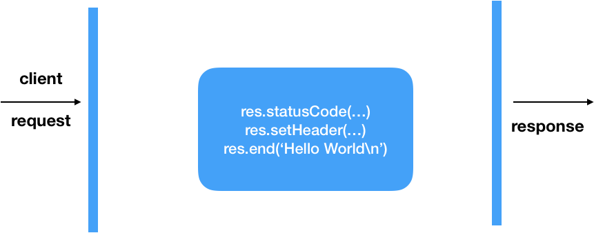
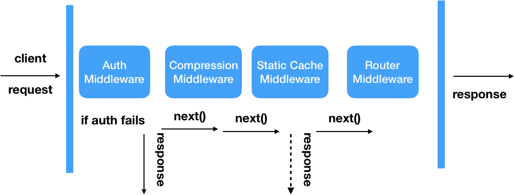
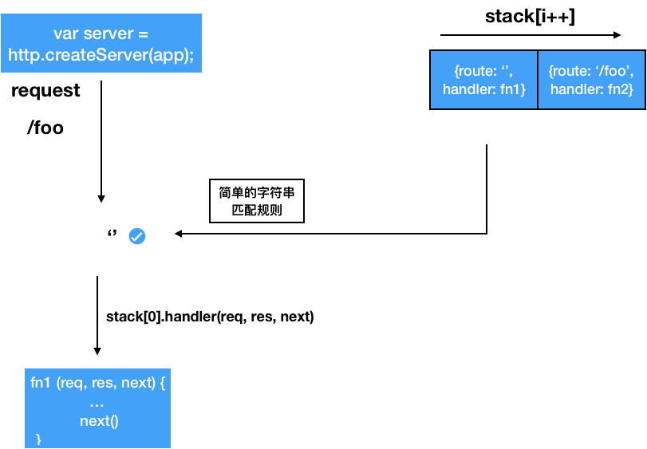
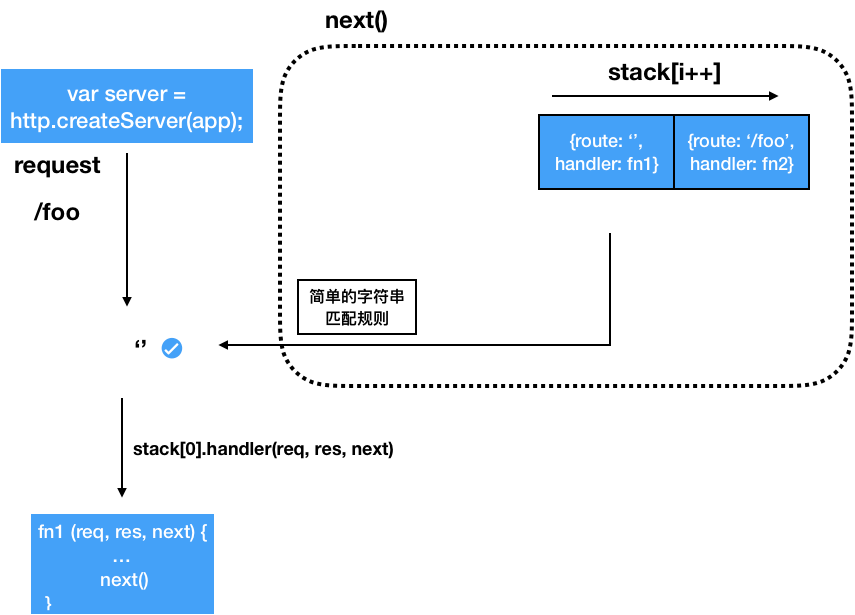
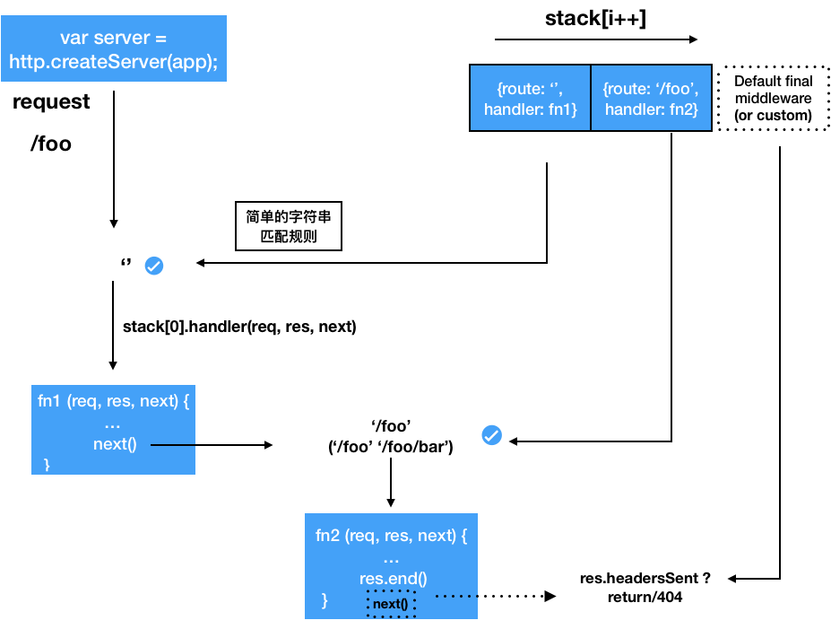
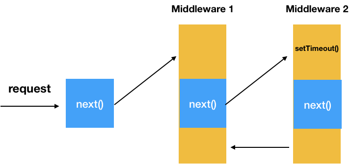
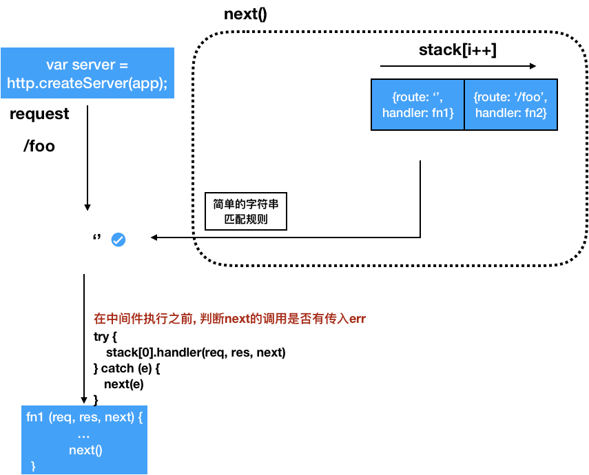
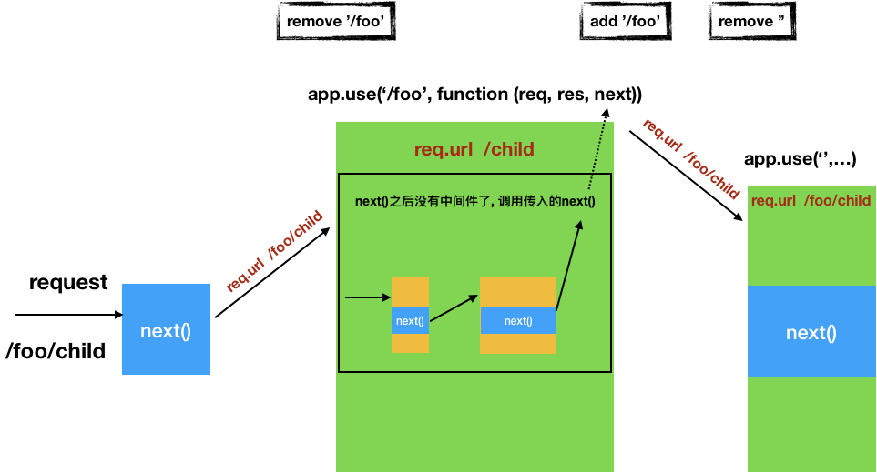
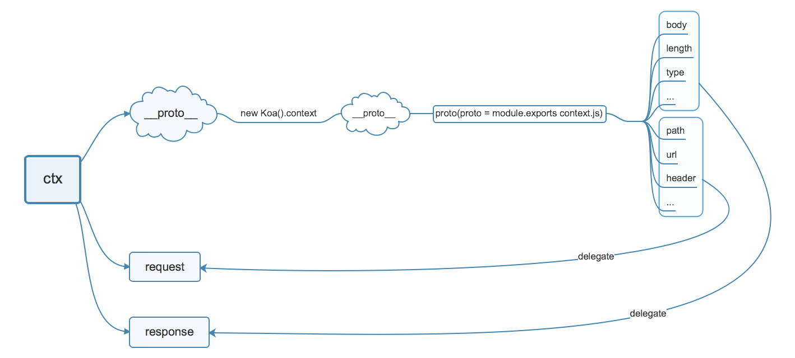
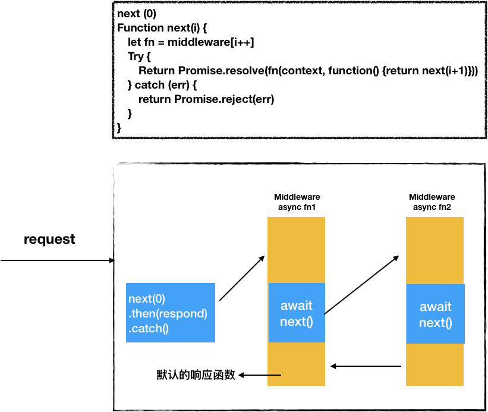

# node http
## 使用node搭建服务器
---
```js
const http = require('http');

const hostname = '127.0.0.1';
const port = 3000;

// event ‘request’
const server = http.createServer((req, res) => {
  res.statusCode = 200;
  res.setHeader('Content-Type', 'text/plain');
  res.end('Hello World\n');
});

// event ‘listening’
server.listen(port, hostname, () => {
  console.log(`Server running at http://${hostname}:${port}/`);
});
```



这是node官网的一段示例, 若干行代码搭建了一个http服务器.

代码监听了http.Server实例上的'request'事件, 当有请求发送过来, 触发request事件, 则绑定的函数会执行.

所绑定的函数执行了如下操作: 
1. 设置了响应的状态吗、首部`Conten-Type`.
2. 对所有的请求都返回了相同的内容.

但是实际在使用的时候, 我们可能需要: 
- 对请求进行权限判断
- 对不同的请求路径做不同的响应. (router)
- 对响应主体进行压缩 (gzip)
- 静态资源缓存策略
- ...

可以发现, 其实这些任务其实可以排个序, 中间件就是帮助我们完成这个任务.

## 中间件
---


中间件可以把服务端的操作解耦开来. 不同的中间件各司其职, 如上图——使用中间件实现一个逻辑简单的服务器, static cache中间件可以响应静态文件, router中间件可以用来响应API.

### 中间件更具体的作用
- 处理逻辑
- 修改/扩展已有的对象(请求req, 响应res)
- 将控制权交给下一个中间件 next()
- 结束reques-response cycle( 调用res.end()结束请求, 结束请求后, 还调用next() 可能会产生错误, 比如对已经响应的请求 setHeader)

### 举个栗子 如何实现compression中间件?
```js
function compression(req, res, next) {
    let _end = res.end
    let _write = res.write

    res.write = function (chunk, encoding) {
        //对chunk压缩, 使用_write写入压缩后的数据
        _write.call(res, compressedChunk)
    }

    res.end = function (chunk, encoding) {
      // ...
      _end.call(res)
    }
    next()
}
```

(通常压缩的过程可以使用node中的 Transform Stream, 输入数据 -> 对数据处理 -> 输出数据)

这个中间件对已有的res方法进行了包装, 并调用next() 将控制权交给下一个中间件, 后面的中间件都可以使用被compression中间件包装过的res方法.

一个完善的compression中间件应该还包括, 自适应请求的Accept-Encoding首部; 提供一个threshold阈值, 响应主体大于该阈值再进行压缩等功能.

# connect -> express -> koa (3.6.6, 4.x, 2.5.1)
---
## 作者
> TJ Holowaychuk，程序员兼艺术家，Koa、Co、Express、jade、mocha、node-canvas、commander.js等知名开源项目的创建和贡献者

*任何一个做node.js开发的人, 一定都直接或间接引用过他写的库*

## connect
---
> Connect is an extensible HTTP server framework for node using "plugins" known as middleware

connect是express的基础, 它们middleware的实现原理相同. 早期的express中间件实现部分是直接引用了connect包, 后来express自己实现来中间件的逻辑, 实现方式和connect基本一致.

### connect示例
```js
var connect = require('connect');
var http = require('http');
var compression = require('compression');
var bodyParser = require('body-parser');

var app = connect();

app.use(compression());

app.use(bodyParser.urlencoded({extended: false}));

app.use(function(req, res){
  res.setHeader('Content-Type', 'text/plain');
  res.end('Hello from Connect!\n'); // content-length达不到压缩的要求
});

http.createServer(app).listen(3000);
```

不同的功能分别对应各自的中间件.

### connect 中间件执行同步代码
```js
const indentString = require('indent-string')
const connect = require('connect')
const app = connect()

app.use((req, res, next) => {
  console.log(indentString('->1 middleware', 0))
  next()
  console.log(indentString('<-1 middleware after next', 0))
})

app.use('/foo', (req, res, next) => {
  console.log(indentString('->foo middleware', 8))
  res.end('foo')
})

app.listen(3000)

// output
// /foo
->1 middleware
        ->foo middleware
<-1 middleware after next
```

其实坦白说中间件是要实现类似如下的功能---- 函数的嵌套调用
```js
http.createServer(function app (req, res) {
  fn1 (req, res) {
    fn2 (req, res) {
      fn3 (req, res) {}
    }
  }
})
```

#### 同步代码示例图1.0


stack中存放着通过use加入中间件, 当请求到达时, app函数调用内部的next(), 该next()函数实现如下功能:
1. 读取stack
2. 路径匹配 ? 调用stack[index].handler(req, res, next) : 继续调用next()

#### next()示例图


next()函数的作用就是上图虚线所框选部分, 读取stack, 并进行路径匹配, 路径不匹配则继续调用next()函数.

#### 同步代码示例2.0


### connect中间件执行异步代码
```js
app.use((req, res, next) => {
  console.log('->1 middleware')
  next()
  console.log('<-1 middleware after next')
})

app.use((req, res, next) => {
  setTimeout(() => {
    console.log('->final middleware')
    res.end('hello')
  }, 100)
})
// output
//->1 middleware
//<-1 middleware after next
//        ->final middleware
```

(middleware2 中的next()可有可无)

异步代码执行的顺序, 不同于同步代码.

异步代码和同步代码的执行对于异步操作来说, 需要注意的地方在于如何进行错误处理.

### 错误处理


connect中, 中间件的执行是被try catch包裹的, 捕捉到err, 就会传给next()函数.

之前有说过, next()函数的作用: 
1. 读取stack
2. 路径匹配 ? 调用stack[index].handler(req, res, next) : 直接调用next()

其实在步骤2的时候, 在路径匹配到中间件之后, 会先判断next()函数是否传入err, 若传入了err, 则判断中间件fn.length === 4, 若不是, 则反复调用next()直到finalHandler来处理err

#### 同步代码错误处理
```js
app.use(function (req, res, next) {
  next(new Error('boom!'));
  // throw new Error(‘boom!’) 
});

app.use(function onerror(err, req, res, next) {
  // an error occurred!
});
```

#### 异步代码错误处理
```js
app.use(function (req, res, next) {
    fs.readFile("/file-does-not-exist", function (err, data) {
        if (err) {
          next(err); 
        }
        else {
          //...
        }
})
```
或者可以用promise包裹, 进行错误处理.

```js
app.use(function (req, res, next) {
    setTimeout(() => {
      throw new Error('test error')
    }
  }, 100)
});
```
上面代码的错误, connect包裹中间件的try catch无法捕捉到
```js
app.use((req, res, next) => {
  setTimeout(() => {
    try {
      throw new Error('test error')
      console.log(indentString('->final middleware', 8))
      res.end('hello')
    } catch (err) {
      next(err)
    }
  }, 100)
})
```
*整体来看, connect的错误处理, 其实并不优雅.*, 需要利用next()函数来传递err.

### 路由嵌套
```js
const connect = require('connect')
const http = require('http')

const router = connect()
const app = connect()

router.use('/child1', (req, res, next) => {
  res.end('<h1>child1</h1>')
})

router.use('/child2', (req, res, next) => {
  res.end('<h1>child2</h1>')
})

app.use('/foo', router)

http.createServer(app).listen(3000)
```
#### 路由嵌套的原理


### 代码演示, 解析前端发送的请求, content-type: application/json
```js
const connect = require('connect')
const fs = require('fs')
const path = require('path')

const app = connect()

app.use((req, res, next) => {
  let type = req.headers['content-type'] || ''
  type = type.split(';')[0]
  if (type !== 'application/json') return next()
  let data = ''

  req.on('data', (chunk) => {
    data += chunk
  })
  req.on('end', () => {
    req.body = JSON.parse(data)
    next()
  })
})

app.use('/home', (req, res) => {
  console.log('req.url', req.url)
  fs.createReadStream(path.resolve(__dirname , './index.html')).pipe(res)
})

app.use('/foo', (req, res, next) => {
  console.log(req.body)
  res.setHeader('Content-Type', 'application/json')
  res.end(JSON.stringify({
    resFirstName: req.body.firstName,
    resLastName: req.body.lastName
  }))
})

app.listen(3001)
```

### connect 总结
1. 实现了中间件的逻辑处理.
2. 有简单的路由判断, 有'子路由'的功能

可能不够优雅的地方: 
1. 响应请求的过程耦合在中间件中.
2. 错误处理还是差点感觉, 同步代码的错误, 可以不管, 由最外层包裹中间件的try catch进行捕捉, 异步代码的错误, 需要传给next(err).

## express 4.x
---
express4.x之前, 直接依赖了connect包, 4.x之后, 直接实现了中间件的逻辑.

### express对比connect
- 对node原生req, res进行了包装和扩展, 使用原型链, 乍一看, 还是让人蛮眼花缭乱的.
- express4.x之前内置了常用的中间件( built-in middleware), 4.x以后就精简了绝大部分, 仅保留了若干个, (bodyParser.json/urlencoded, serve-static)
- 将router的逻辑单独抽出来, 优化了代码结构
- 升级了的路由匹配
- 提供诸如app.get(), app.post(), app.all()等简便方法

采用正则匹配来处理路由路径, 路由路径的结构类似vue-router
```js
app.get('/users/:userId/books/:bookId', function (req, res) {
  res.send(req.params)
})
```

express更像是connect的升级版本, 底层对中间件的处理, 错误的处理, 差别并不大.

## koa
---
### koa示例
```js
const Koa = require('koa');
const app = new Koa();

// response
app.use(ctx => {
  ctx.body = 'Hello Koa';
});

app.listen(3000);
```
中间件的传参发生了变化, 不再传入`(req,res,next)`, 而是传入`(ctx, next)`

ctx是koa构建的一个上下文对象, ctx.request 是koa包装的request对象, ctx.response包装的response对象

koa没有改动原生的req, res, 而是在其基础上包装了自己的request, response.

ctx.body调用的是ctx.response.body, 对应一个setter方法, 它设置ctx.body属性的同时, 还设置了http响应的状态码status(200)、响应头Content-Type(text/plain)、Content-Length(9).

在所有中间件执行完成后, 若中间件没有响应请求, koa会根据ctx.body的值, 响应请求, 所以响应请求并不一定需要像connect, express那样耦合在中间件中.

### ctx


### koa中间件
#### async/await写法
```js
app.use(async (ctx, next) => {
  const start = Date.now();
  await next();
  const ms = Date.now() - start;
  console.log(`${ctx.method} ${ctx.url} - ${ms}ms`);
});
```
#### 常规写法
```js
app.use((ctx, next) => {
  const start = Date.now();
  return next().then(() => {
    const ms = Date.now() - start;
    console.log(`${ctx.method} ${ctx.url} - ${ms}ms`);
  });
});
```
这段代码记录了调用next() 之后, 中间件处理请求所花的时间.

不同于connect, express, koa的next返回的是一个Promise对象.

*正确书写koa中间件, 可以保证响应请求时, 代码的执行顺序.*

#### 中间件处理示意图


koa的中间件处理方式, 和connect的本质区别在于其next()函数, koa的next()函数返回的是promise对象, 只有在该promise为fulfilled的时候, 才会执行`await next()`以后的代码.

> async 函数中可能会有 await 表达式，这会使 async 函数暂停执行，等待表达式中的 Promise 执行完成后才会继续执行 async 函数并返回. 
> await  操作符用于等待一个Promise 对象

#### 考虑这样一种情况, express/koa 实现返回json格式的响应主体
1. express实现该功能
定义res.json()方法
```js
app.use((req, res) => {
    res.json({foo: 'bar'})
})
res.json = function (data) { // 此res非 箭头函数中的res
    this.set('Content-Type', 'application/json')
  res.end(JSON.stringify(data))
}
```

2. koa实现该功能
```js
app.use((ctx, next) => {
    ctx.body = {foo: 'bar'}  // content-type 在body 的setter中会被设置
})
// koa 默认响应函数
function respond (ctx) {
// ctx.body不是Buffer/String/Stream
res.end(JSON.stringify(ctx.body))
}
```
默认响应函数能够保证, 它拿到的ctx.body是最终不会再变动的

可以看出express 和 koa不同的理念, express需要你确定要响应的内容, 并调用方法返回json格式的主体, 而koa不需要想太多, 设置ctx.body就行了.

### 错误处理
使用aync, await写法, 你可以自己定义一个错误处理中间件, 所有中间件抛出的错误, 让最外层定义的中间件来处理(当然koa其实也自带默认的错误处理函数)
```js
app.use(async (ctx, next) => {
  try {
    await next();
  } catch (err) {
    err.status = err.statusCode || err.status || 500;
    throw err;
  }
});
```
connect, 需要把err传给next()函数, 在koa中, 你只要想办法把err throw出去, 让最外层定义的错误处理中间件去处理就可以.

我们只需要让await真正有效——将异步函数包装成一个promise, 这样就能正确throw err

1. 利用Promise((resolve, reject) => {})中的reject
```js
app.use(async (ctx, next) => {
    function asyncFunc(ms) {
        return new Promise((resolve, reject) => {
            setTimeout(() => {
                reject('err')
            }, ms)
        })
    }
    await asyncFunc(2000)
    await next()
});
```
2. 利用util.promisify, 处理node式异步函数

```js
app.use(async (ctx, next) => {
  const read = util.promisify(fs.readFile)
  await read('./ccccc.js')
  await next()
})
```
### koa2对比express
#### 1. 构建项目上
- 更加轻量级, 当你使用koa构建项目的时候, 它只是帮你搭了一个空房子, 你不断往里面放置你所需要的家具. 而用express新构建的项目更像是已经有一些家具的房子. 相比较来说koa的可定制性更高.
#### 2. 处理请求和响应上
- koa没有改动node的请求和响应对象req, res, 而是包装了自己的请求响应对象, request, response, 你在使用的时候可以很明确地知道自己在使用koa提供的方法/属性(即便它可能就是直接调用的node原生方法/属性). 而express通过原型链的方式为req, res扩展方法/属性, 在使用的过程中, 会比较懵.
#### 3. flow of the middleware chain
- koa的next()配合async/await 使得代码执行顺序很明了. express则没有这个优势, next()之后的代码执行的时机要具体情况具体分析, 因此, 不会在其中间件的next()之后写代码, 因为意义不大. 而koa由于代码执行顺序可控, 其在所有中间件执行完后, 会有默认的响应函数来响应请求.

#### 4. 错误处理
- koa在错误处理的时候可以很方便地进行全局错误捕获(本质上是第3点所导致的, 因为代码执行顺序可控). express则使用node式的错误处理方式, 将错误作为第一个参数传给next()函数.
#### 5. 社区
- express发展较久, 各种中间件应有尽有, 而且质量禁得起考验. koa的中间件数量相对来说没有express更丰富, 也许存在着需要自己造轮子, 或者已有轮子有bug的情况?

#### 6.性能
个人看法: 虽然koa2比express更轻量, 但是从express 的 callback style 到 koa 的Promise style, 会损失一部分性能

暂无很有说服力的压力测试实验 

网上有有些压力测试, 测试结果是koa2性能更好.

> https://github.com/jkyberneees/ana#performance-comparison-framework-overhead
> https://cnodejs.org/topic/5728267f3f27a7c841bcb88e

### koa总结
1. 构建了ctx.request/response, 并没有改动原生的node req, res.
2. 异步的情况下, 代码执行顺序可控.
3. 利用async await可以优雅地进行错误处理.
4. 代码精简, 没有路由功能.
5. 在中间件执行完后, 有默认的响应函数, 若中间件中没有响应请求, 响应函数会主要根据ctx.body响应请求. (connect, express都必须在中间件中调用res.end())

## connect express koa 简单对比
| Feature           | Koa | Express | Connect |
|------------------:|-----|---------|---------|
| 中间件 | Promise-based   |   常规操作     | 常规操作       |
| 路由           |    无 |  功能较全       |    极简...     |
| 错误处理        |  async/await 配合 try/catch   |  同connect     |  中规中矩利用next(err)        |
|  集成额外功能     |  无   |  jsonp/ template等      |     无    |

## express 和koa怎么选择?
一些个人观点

1. 项目是基于已有的express项目, 继续用express 吧...
2. callback style 和 promise style的倾向
3. 自身是倾向于使用一个轻量级的框架, 用到什么功能就加什么, 还是倾向于使用一个本身具备一些常用功能的框架.
4. 项目的用途
5. 性能


## 参考文献
> https://medium.com/@selvaganesh93/how-node-js-middleware-works-d8e02a936113
> https://juejin.im/post/5ad466d25188253edd4d898a
> https://developer.mozilla.org/zh-CN/docs/Web/JavaScript/Reference/Statements/async_function
> https://github.com/brunoyang/blog/issues/5
> https://cnodejs.org/topic/5b9a5867ce9d14c2254dfa13
> https://github.com/koajs/koa/issues/797
> https://raygun.com/blog/koa-vs-express-2018/
> https://medium.com/@kennykoch47/should-you-choose-koa-over-express-686b6bcc7b4d